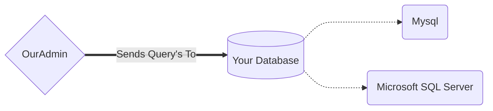

# OurAdmin - Windows Version

OurAdmin is a SQL database client where you can access and edit your databases through a GUI.

*We support:*

- **Mysql**
- **Microsoft SQL Server**

## Download

You can download the latest version from the <ins>release</ins> section.

## Installation

You can install the project by opening:
**`
Setup.exe
`**

## How does it work (in a nutshell)
Its actualy fairly simple, OurAdmin sends SQL query's to you configured database.

Through those query's OurAdmin is able to get the needed information to display it on the client.

## Contributing
We greatly welcome contributions to this project.

## License
[Apache 2.0](https://github.com/Sten435/OurAdmin-Windows/blob/main/LICENSE)
